# SampleFundTransferService
This is a prototype for SampleFundTransferService that provides RESTful api related to customer's fund transfer.

## Running the application

Go to the project root directory and run following commands:  
```
./mvnw clean install
./mvnw spring-boot:run
```

Go to Swagger UI at http://localhost:8080/swagger-ui/index.html?configUrl=/v3/api-docs/swagger-config#/

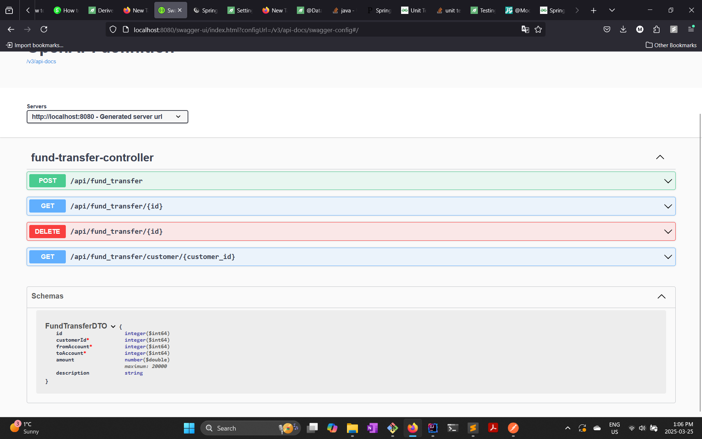

### Sample Responses per api
### 1. Create a Transfer
- Request body
```json
{
  "fromAccount": "123456789",
  "toAccount": "987654321",
  "amount": 100.50,
  "description": "Payment for invoice #123"
}
```
#### Sample Save Req/Res instance -   
Request:   
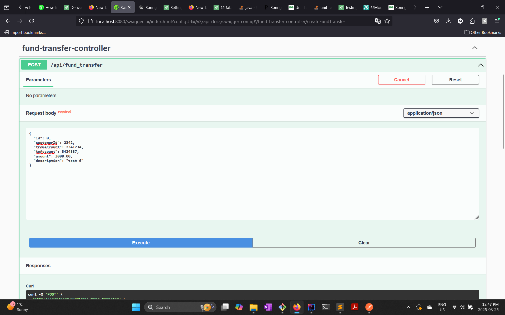    
Response:  
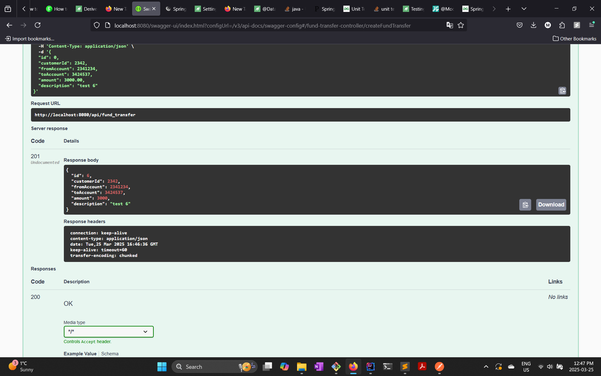    

- Sample response for Validation criteria
    - `amount` must be greater than zero and less than 20000   
  #### Sample req/res for amount less than zero:   
  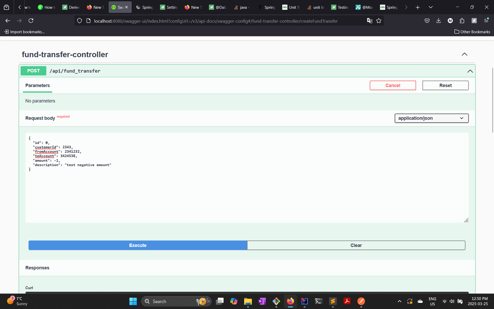
  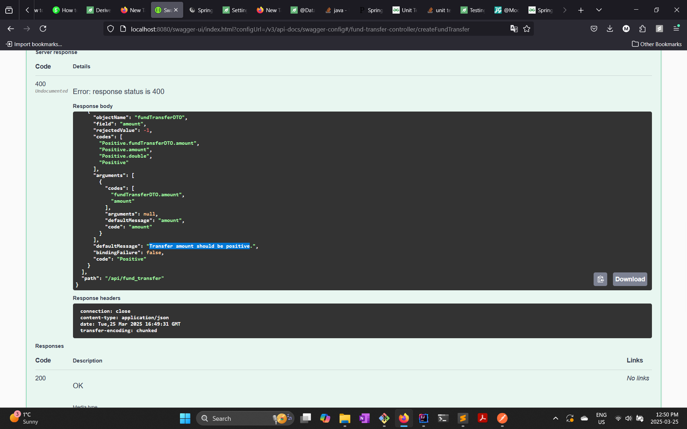
  
  #### Sample req/res for amount greater than 20000:  
  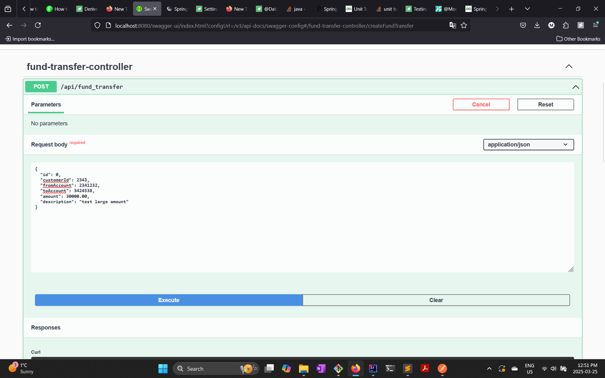
  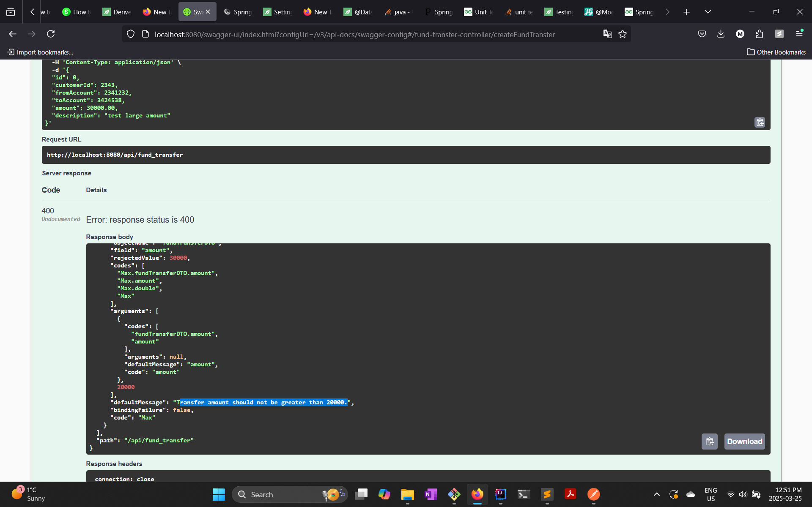
  
  - A user can't create more than 10 pending transactions at a time    
  #### Sample request for user creating fund transfer over limit:
  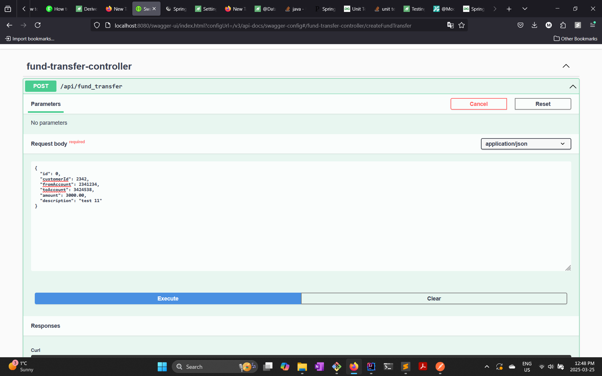
  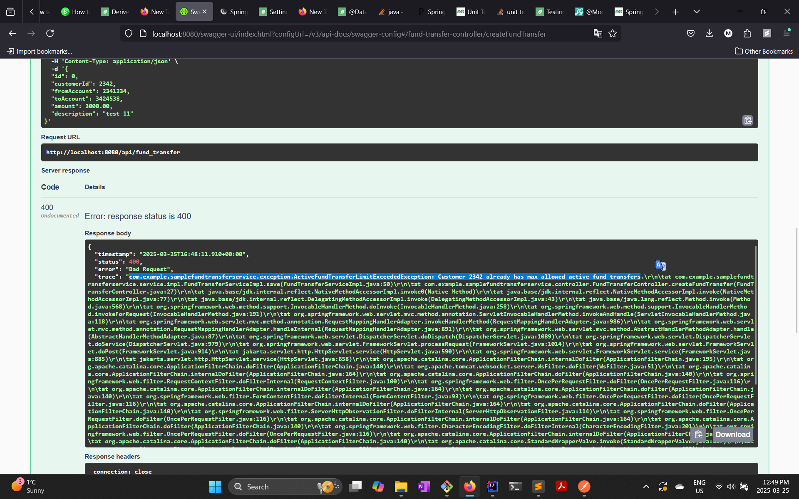
  
### 2. Get Transfer Details
#### Sample req/res for get fund transfer by id:
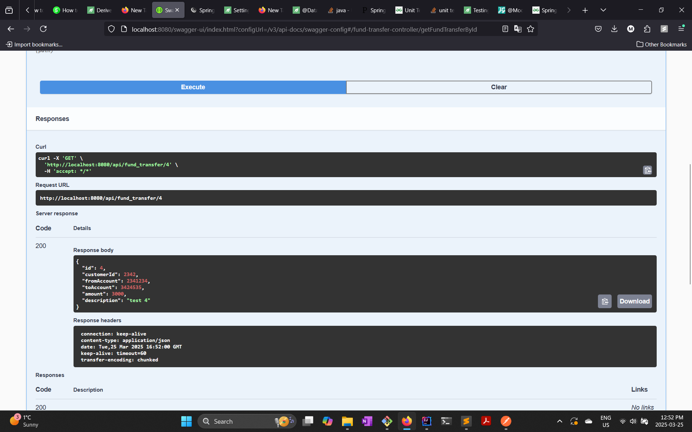

### 3. Get All Transfers for a User
#### Sample req/res for get fund transfer by user(customerId):
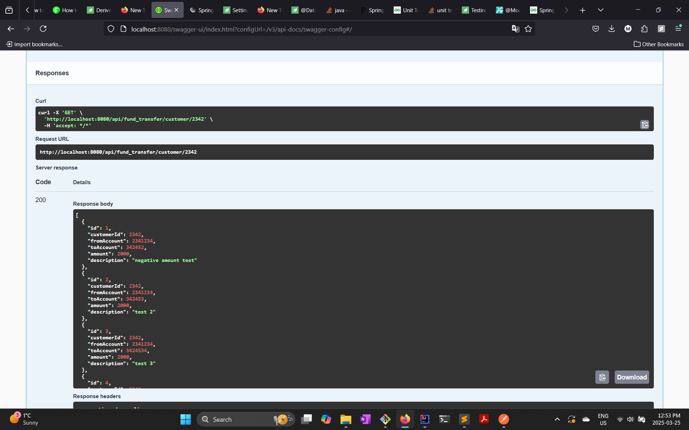  
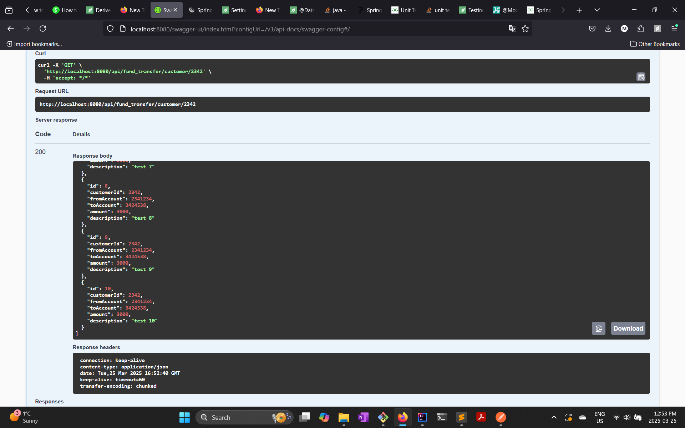  

### 4. Cancel a Transfer
#### Sample req/res for fund transfer cancel request:
Currently we are not persisting cancelled transfers and they are hard deleted.


Customers active fund transfers after deletion:
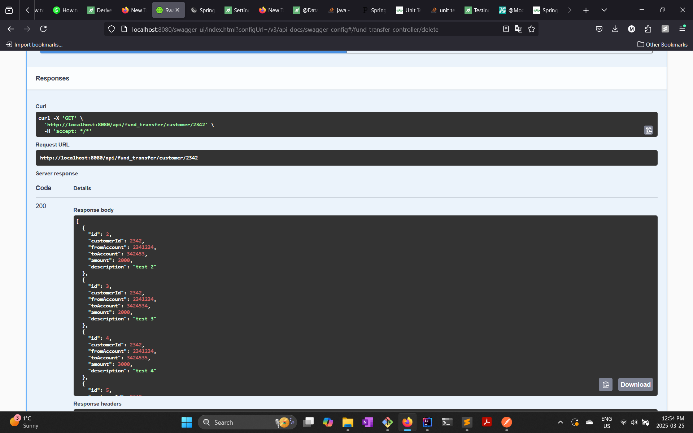

